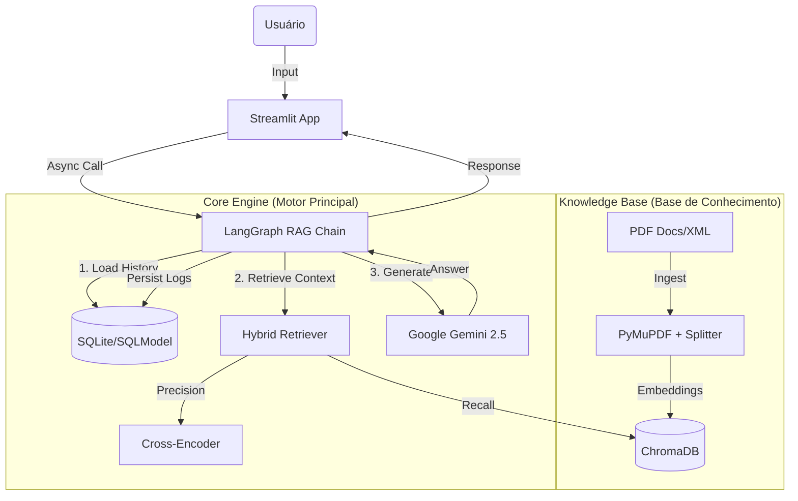
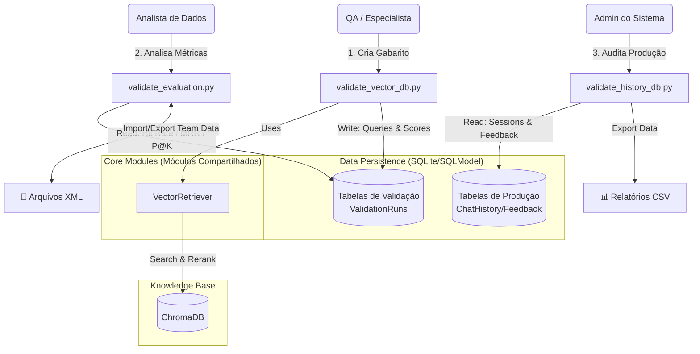
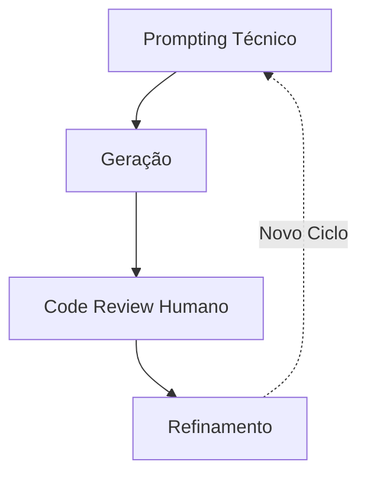

# 🏛️ Chatbot RAG - Programa Quita Goiás

> **Arquitetura:** Modular Monolith Async | **Orquestração:** LangGraph | **LLM:** Google Gemini 2.5 Flash


Este projeto implementa um assistente virtual de alta performance baseado em **RAG (Retrieval-Augmented Generation)**.
Projetado para responder dúvidas sobre legislação tributária com precisão, ele utiliza uma arquitetura assíncrona moderna, persistência estruturada via **SQLModel** e um pipeline de recuperação híbrida (Vetorial + Re-ranking).

O grande diferencial é a sua **Suíte de Auditoria e Avaliação (QA Suite)**, que permite a criação de "Gabaritos" (Ground Truth) persistentes no banco de dados, garantindo transparência e métricas auditáveis (Hit Rate, MRR, Precision@K).

-----

## 💡 Dica de Visualização (Diagramas)

Este documento contém diagramas de arquitetura complexos usando a sintaxe **Mermaid**. Para visualizá-los corretamente (renderizados como gráficos e não como código), recomenda-se o seguinte ambiente:

* **Editor de Código:** [Visual Studio Code (VS Code)](https://code.visualstudio.com/download)
* **Extensão Recomendada:** [Markdown Preview Mermaid Support](https://marketplace.visualstudio.com/items?itemName=bierner.markdown-mermaid) (por Matt Bierner).

---

## 🧩 Arquitetura da Solução

O sistema opera de forma assíncrona para garantir fluidez na UI enquanto processa chamadas pesadas de LLM e Banco de Dados.







### Destaques Técnicos

  * **Hybrid Retrieval:** Combina a velocidade da busca vetorial (`all-MiniLM-L6-v2`) com a precisão semântica de um Cross-Encoder (`ms-marco-MiniLM-L6-v2`) para reordenar os resultados.
  * **LangGraph:** Orquestração de estado (*Stateful*) para gerenciar o fluxo de conversação e memória de curto prazo.
  * **Async SQLModel:** Uso de `aiosqlite` e `SQLAlchemy 2.0` para persistência não-bloqueante de históricos, feedbacks e métricas de validação.
  * **Auditabilidade Total:** Todas as validações manuais (Gabaritos) são salvas no banco de dados, permitindo a reprodução de testes e auditoria de viés.

-----

## 📂 Estrutura do Projeto

```text
📂 rag_chatbot
│
├── 📂 docs/                        # [Input] Coloque aqui seus PDFs e XMLs
│
├── 📂 database/                    # [Storage] Persistência Relacional (Gerado Automático)
│   └── 💾 chat_database.db         # Histórico de Chat, Feedbacks e Métricas
│
├── 📂 vector_db/                   # [Storage] Banco Vetorial (Gerado Automático)
│   └── 💾 ...                      # Arquivos do ChromaDB
│
├── 📜 app.py                       # [App] Interface de Chat (Usuário Final)
├── 📜 rag_chain.py                 # [Core] Lógica RAG, LangGraph e Memória
├── 📜 vector_retriever.py          # [Core] Motor de Busca (Recall + Rerank)
├── 📜 database.py                  # [Model] Schemas do Banco (SQLModel)
├── 📜 settings.py                  # [Config] Variáveis de Ambiente e Caminhos
├── 📜 ui_utils.py                  # [Utils] Helpers de UI (Impressão, Foco)
│
├── 🔧 ETL & Ingestão
│   ├── 📜 ingest.py                # Pipeline PDF -> Chunks Fixos -> VectorDB
│   └── 📜 ingest_xml.py            # Pipeline XML -> Chunks Semânticos -> VectorDB
│
└── 🛠️ Ferramentas de Auditoria (QA)
    ├── 📜 validate_vector_db.py    # [Coleta] Teste de Retrieval e Criação de Gabarito
    ├── 📜 validate_evaluation.py   # [Análise] Dashboard de Métricas (HR, MRR)
    └── 📜 validate_history_db.py   # [Auditoria] Logs de Produção e Feedbacks
```

-----

## 🚀 Instalação e Configuração

### 1\. Pré-requisitos

  * Python 3.10+
  * Chave de API do Google AI Studio (`GEMINI_API_KEY`)

### 2\. Configuração do Ambiente

**Opção A: Usando `venv` (Padrão do Python)**

```bash
# 1. Crie o ambiente (usando o nome 'rag_solution')
python -m venv rag_solution

# 2. Ative o ambiente
# Windows
.\rag_solution\Scripts\activate
# macOS/Linux
source rag_solution/bin/activate
```

-----

**Opção B: Usando `conda` (Anaconda)**

```bash
# 1. Crie o ambiente (usando o nome 'rag_solution' e especificando Python 3.10+)
conda create -n rag_solution python=3.10

# 2. Ative o ambiente
conda activate rag_solution
```

### 3. Instalação das Dependências

Com o ambiente virtual (`rag_solution`) ativo, instale todas as bibliotecas listadas no `requirements.txt`:

```bash
pip install -r requirements.txt
```

### 4\. Variáveis de Ambiente

Crie um arquivo `.env` na raiz do projeto:

```ini
GEMINI_API_KEY="sua_chave_aqui"
DATABASE_URL="sqlite+aiosqlite:///./database/chat_database.db"
```

### 5\. Ingestão de Dados

Coloque seus arquivos na pasta `docs/` e execute o pipeline correspondente ao formato dos seus dados:

**Opção A: Arquivos PDF (Ingestão Padrão)**

Para processar documentos PDF brutos. O sistema fará a limpeza, sanitização e divisão (splitting) automática baseada em caracteres.

```bash
python ingest.py
```

**Opção B: Arquivos XML (Semantic Chunking)**

Para ingerir dados que já passaram por um processo de "Semantic Chunking" externo e estão estruturados em XML (Pergunta/Resposta/Metadados).

```bash
python ingest_xml.py
```

*(Nota: Ambos os scripts recriam automaticamente as pastas `database/` e `vector_db/`. **Execute apenas um dos scripts**, dependendo de qual fonte de dados você deseja utilizar no momento.)*

-----

## 🖥️ Guia de Utilização

O projeto é composto por **4 aplicações Streamlit** distintas. Execute-as em terminais separados conforme a necessidade.

### 1\. Chatbot (Produção)

A interface principal para o usuário final.

```bash
streamlit run app.py
```

### 2\. Suíte de Avaliação (Data-Driven Development)

Ferramentas para engenheiros e especialistas de domínio validarem a qualidade do bot.

#### A. Coleta de Métricas (O "Gabarito")

Ferramenta para testar queries e marcar manualmente quais chunks são relevantes. Essencial para calcular a precisão do sistema.

```bash
streamlit run validate_vector_db.py
```

> **Fluxo de Uso:**
>
> 1.  Digite uma pergunta.
> 2.  Veja os resultados do RAG.
> 3.  Marque os checkboxes dos trechos corretos (**Hit Rate**).
> 4.  Selecione o melhor trecho no Radio Button (**MRR**).
> 5.  Salve a avaliação.

#### B. Dashboard de Performance

Analisa os dados coletados na etapa anterior, exibindo métricas consolidadas.

```bash
streamlit run validate_evaluation.py
```

  * **Hit Rate:** Frequência com que a resposta correta aparece nos resultados.
  * **MRR (Mean Reciprocal Rank):** Quão bem posicionado (1º, 2º, 3º...) está o melhor resultado.
  * **Exportação:** Gera XMLs para compartilhar avaliações entre a equipe.

#### C. Auditoria de Histórico

Monitora o uso real em produção.

```bash
streamlit run validate_history_db.py
```

  * Visualize conversas completas por ID de sessão.
  * Filtre por Feedbacks negativos (👎) para ajustar o conteúdo.

-----

## 📊 Entendendo as Métricas

O sistema calcula automaticamente três métricas vitais para RAG:

| Métrica | O que mede? | Exemplo |
| :--- | :--- | :--- |
| **Hit Rate** | Capacidade de encontrar *alguma* resposta útil. | Se a resposta certa apareceu (mesmo em 3º lugar), é 1. Se não, 0. |
| **MRR** | Qualidade da ordenação (Ranking). | Se a melhor resposta é a 1ª, MRR=1.0. Se for a 2ª, MRR=0.5. Se for a 3ª, MRR=0.33. |
| **Precision@K** | Densidade de informação útil. | Se dos 3 chunks retornados, 2 são úteis, P@K = 0.66. |

-----

## 🛠️ Stack Tecnológico

  * **Frontend:** Streamlit 1.50
  * **Core AI:** LangChain 1.0, LangGraph, Google Gemini 1.5
  * **Data:** SQLModel (SQLAlchemy + Pydantic), ChromaDB (Vector Store)
  * **NLP:** Sentence-Transformers (Embeddings + Cross-Encoders)
  * **Utils:** PyMuPDF, Python-Dotenv

-----

## 6\. 🔄 Nota sobre o Desenvolvimento e Colaboração com IA

Este projeto representa um fluxo de trabalho moderno de **Desenvolvimento Assistido por IA** (*AI-Assisted Development*).

A divisão de responsabilidades neste projeto seguiu a filosofia de "Human in the Loop":

  * **👨‍💻 Engenheiro Humano (Arquiteto & Product Owner):**

      * Concepção da **Arquitetura de Sistema** e padrões de projeto.
      * Definição de todas as **Regras de Negócio** e requisitos funcionais.
      * Desenho do **Fluxo de Dados** e estratégias de validação (QA).

  * **🤖 Google Gemini (AI Pair Programmer):**

      * Geração de sintaxe de código (*boilerplate* e implementações complexas) em Python e SQLModel.
      * Refatoração para padrões modernos (migração para `async/await`).
      * Criação de documentação técnica.

  * **🔄 Fluxo de Trabalho:**
    * O desenvolvimento seguiu um ciclo iterativo onde o desenvolvedor solicitava funcionalidades via linguagem natural (prompting técnico).
    * O modelo gerava a implementação, e o desenvolvedor realizava a revisão de código (*Code Review*), ajustes finos e integração final.

